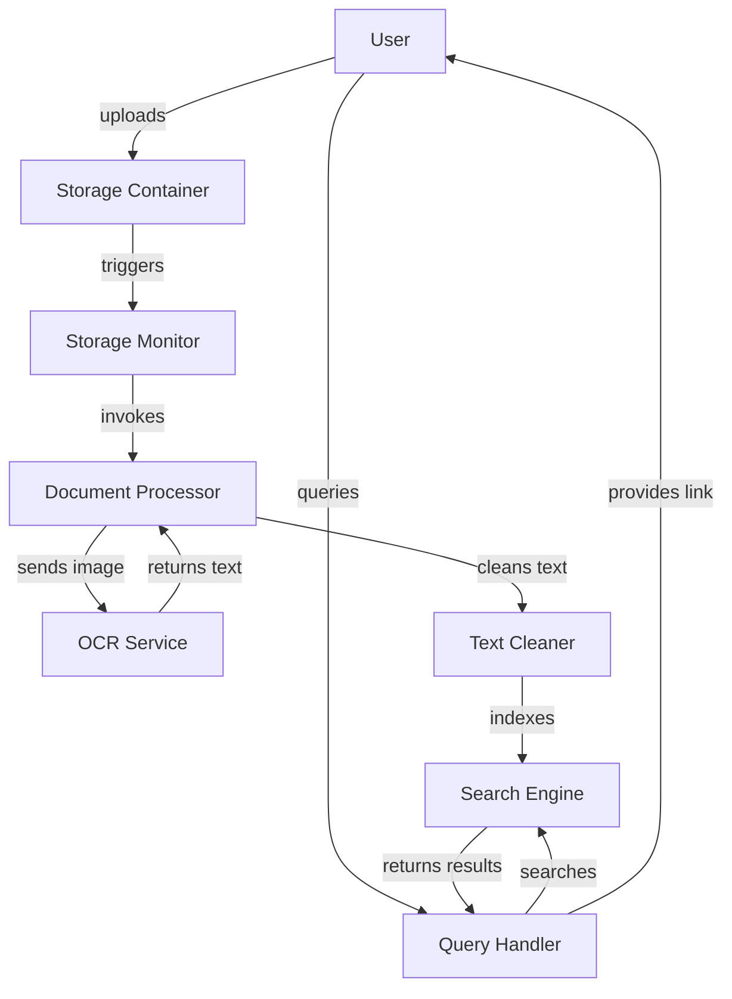

# Technical Design: OCR Document Extraction System

## Overview

This document outlines the technical design for an automated OCR-based document text extraction and search system. The system enables users to upload document images, automatically extracts text using OCR technology, and provides full-text search capabilities.

## High-Level Architecture

### System Components



### Component Responsibilities

1. **Storage Container**: Blob/object storage for uploaded document images
2. **Storage Monitor**: Event-driven service that detects new uploads
3. **Document Processor**: Orchestrates the OCR workflow
4. **OCR Service**: Performs optical character recognition
5. **Text Cleaner**: Normalizes and structures extracted text
6. **Search Engine**: Indexes and queries document content
7. **Query Handler**: Processes user search requests

## Data Models

### Document
```
Document {
  id: UUID
  filename: String
  uploadTimestamp: DateTime
  storageUrl: String
  contentType: String
  status: Enum[UPLOADED, PROCESSING, INDEXED, FAILED]
}
```

### OCRResult
```
OCRResult {
  documentId: UUID
  rawText: String
  confidence: Float
  processingTime: Duration
  metadata: Map<String, Any>
}
```

### IndexedDocument
```
IndexedDocument {
  documentId: UUID
  cleanedText: String
  keywords: List<String>
  indexTimestamp: DateTime
  searchableContent: String
}
```

## Low-Level Design

### Algorithm: Document Processing Pipeline

```
FUNCTION processDocument(documentId: UUID) -> Result<IndexedDocument>
  PRECONDITION: Document exists in storage
  POSTCONDITION: Document is indexed OR error is logged
  
  BEGIN
    document ← fetchDocument(documentId)
    IF document.status ≠ UPLOADED THEN
      RETURN Error("Invalid document status")
    END IF
    
    updateStatus(documentId, PROCESSING)
    
    ocrResult ← performOCR(document.storageUrl)
    IF ocrResult.isError THEN
      updateStatus(documentId, FAILED)
      RETURN Error(ocrResult.error)
    END IF
    
    cleanedText ← cleanText(ocrResult.rawText)
    indexedDoc ← indexDocument(documentId, cleanedText)
    
    updateStatus(documentId, INDEXED)
    RETURN Success(indexedDoc)
  END
```

### Algorithm: Text Cleaning

```
FUNCTION cleanText(rawText: String) -> String
  PRECONDITION: rawText is not null
  POSTCONDITION: Returns normalized, structured text
  
  BEGIN
    text ← rawText
    
    // Remove irregular whitespace
    text ← normalizeWhitespace(text)
    
    // Fix common OCR errors
    text ← correctCommonErrors(text)
    
    // Remove special characters
    text ← removeNonPrintable(text)
    
    // Normalize case for indexing
    text ← toLowerCase(text)
    
    RETURN text
  END
```

### Algorithm: Search Query Processing

```
FUNCTION searchDocuments(query: String) -> List<SearchResult>
  PRECONDITION: query is not empty
  POSTCONDITION: Returns ranked list of matching documents
  
  BEGIN
    keywords ← tokenize(query)
    results ← []
    
    FOR EACH keyword IN keywords DO
      matches ← searchEngine.query(keyword)
      results ← merge(results, matches)
    END FOR
    
    rankedResults ← rankByRelevance(results)
    
    RETURN rankedResults
  END
```

## Component Interfaces

### Storage Monitor Interface
```
interface StorageMonitor {
  onFileUploaded(event: UploadEvent): void
  registerHandler(handler: EventHandler): void
}
```

### OCR Service Interface
```
interface OCRService {
  extractText(imageUrl: String): Promise<OCRResult>
  getSupportedFormats(): List<String>
}
```

### Search Engine Interface
```
interface SearchEngine {
  index(document: IndexedDocument): Promise<void>
  query(keywords: List<String>): Promise<List<SearchResult>>
  delete(documentId: UUID): Promise<void>
}
```

## Error Handling

- **Upload Failures**: Retry with exponential backoff
- **OCR Failures**: Log error, mark document as FAILED, notify user
- **Indexing Failures**: Queue for retry, alert monitoring system
- **Search Failures**: Return empty results with error message

## Performance Considerations

- Asynchronous processing pipeline
- Batch indexing for multiple documents
- Caching of frequently accessed documents
- Rate limiting on OCR service calls

## Security Considerations

- Validate file types before processing
- Scan uploads for malware
- Encrypt documents at rest and in transit
- Implement access controls on search results

## Testing Strategy

- Unit tests for each component
- Integration tests for the full pipeline
- Property-based tests for text cleaning algorithms
- Load testing for concurrent uploads and searches


## Correctness Properties

*A property is a characteristic or behavior that should hold true across all valid executions of a system—essentially, a formal statement about what the system should do. Properties serve as the bridge between human-readable specifications and machine-verifiable correctness guarantees.*

### Property 1: Document Metadata Recording

*For any* uploaded document with filename, content type, and storage URL, the system SHALL record all metadata fields including upload timestamp.

**Validates: Requirement 1.2**

### Property 2: Document Status State Machine

*For any* document, the status SHALL always be one of the valid states (UPLOADED, PROCESSING, INDEXED, FAILED), and status transitions SHALL follow the valid state machine: UPLOADED → PROCESSING → INDEXED or UPLOADED → PROCESSING → FAILED.

**Validates: Requirements 1.3, 2.3, 4.3, 6.1**

### Property 3: File Type Validation

*For any* file upload attempt, the system SHALL accept only valid file types and reject invalid file types.

**Validates: Requirement 1.4**

### Property 4: Event Handler Invocation

*For any* upload event detected by the Storage Monitor, the Document Processor SHALL be invoked.

**Validates: Requirement 2.2**

### Property 5: OCR Service Orchestration

*For any* document in PROCESSING status, the Document Processor SHALL send the image to the OCR Service.

**Validates: Requirement 2.4**

### Property 6: OCR Failure Handling

*For any* OCR processing failure, the system SHALL update the document status to FAILED, log the error, and notify the user.

**Validates: Requirements 2.6, 7.2**

### Property 7: Whitespace Normalization

*For any* text containing irregular whitespace (multiple spaces, tabs, irregular newlines), the Text Cleaner SHALL normalize it to consistent single spaces and standard line breaks.

**Validates: Requirement 3.1**

### Property 8: OCR Error Correction

*For any* text containing common OCR error patterns, the Text Cleaner SHALL apply corrections.

**Validates: Requirement 3.2**

### Property 9: Non-Printable Character Removal

*For any* text containing non-printable characters, the Text Cleaner SHALL remove them.

**Validates: Requirement 3.3**

### Property 10: Case Normalization

*For any* text with mixed case, the Text Cleaner SHALL normalize case consistently for indexing.

**Validates: Requirement 3.4**

### Property 11: Text Cleaning Invariant

*For any* valid OCR Result with non-empty raw text, cleaning the text SHALL produce a non-empty string.

**Validates: Requirement 3.5**

### Property 12: Document Indexing Completeness

*For any* cleaned text, the Search Engine SHALL create an index entry containing both the cleaned text and extracted keywords.

**Validates: Requirement 4.1**

### Property 13: Index Timestamp Recording

*For any* document that is indexed, the system SHALL record the index timestamp.

**Validates: Requirement 4.2**

### Property 14: Indexing Failure Retry

*For any* indexing failure, the system SHALL queue the document for retry and alert the monitoring system.

**Validates: Requirement 4.4**

### Property 15: Batch Indexing Support

*For any* collection of multiple documents, the Search Engine SHALL successfully index them in batch mode.

**Validates: Requirement 4.5**

### Property 16: Query Tokenization

*For any* non-empty search query string, the Query Handler SHALL tokenize it into one or more keywords.

**Validates: Requirement 5.1**

### Property 17: Search Engine Invocation

*For any* extracted keyword list, the Query Handler SHALL send them to the Search Engine.

**Validates: Requirement 5.2**

### Property 18: Search Result Ranking

*For any* set of keywords and indexed documents, the Search Engine SHALL return matching documents ranked by relevance score.

**Validates: Requirement 5.3**

### Property 19: Search Result URL Inclusion

*For any* search result returned, the Query Handler SHALL include the storage URL for the original document.

**Validates: Requirements 5.4, 10.2**

### Property 20: Status Persistence

*For any* document status change, the system SHALL persist the new status to storage.

**Validates: Requirement 6.2**

### Property 21: Processing Precondition

*For any* document not in UPLOADED status, the system SHALL reject attempts to start OCR processing.

**Validates: Requirement 6.3**

### Property 22: Error Details Availability

*For any* document in FAILED status, the system SHALL provide error details describing the failure.

**Validates: Requirement 6.4**

### Property 23: Upload Retry with Exponential Backoff

*For any* upload failure, the system SHALL retry with exponentially increasing delays between attempts.

**Validates: Requirement 7.1**

### Property 24: Indexing Retry Queue

*For any* indexing failure, the system SHALL add the document to the retry queue.

**Validates: Requirement 7.3**

### Property 25: Error Logging Completeness

*For any* error that occurs, the system SHALL log sufficient detail for debugging including error type, context, and timestamp.

**Validates: Requirement 7.4**

### Property 26: OCR Rate Limiting

*For any* sequence of OCR service calls, the system SHALL enforce rate limits to prevent exceeding service quotas.

**Validates: Requirement 8.3**

### Property 27: Document Caching

*For any* document accessed multiple times within a time window, the system SHALL serve subsequent requests from cache.

**Validates: Requirement 8.4**

### Property 28: Search Result Access Control

*For any* search request, the system SHALL enforce access controls and return only documents the requester is authorized to access.

**Validates: Requirement 9.3**

### Property 29: Storage URL Validity

*For any* indexed document, the storage URL SHALL remain valid and accessible.

**Validates: Requirement 10.3**

### Property 30: Document Deletion Completeness

*For any* document deletion request, the system SHALL remove the document from both the Storage Container and the Search Engine index.

**Validates: Requirement 10.4**
